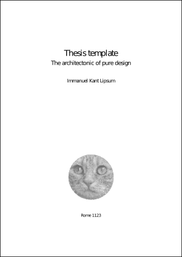

# kant-thesis

A LaTeX thesis template for whoever may need one. I created the template while writing my [own thesis](https://edoc.ub.uni-muenchen.de/20380/1/Weber_Markus_F.pdf) and playing around with LaTeX packages. As it is easier to throw stuff out than to put back in, I left various packages in the template that I did not use in the end (e.g., epigraphs and margin notes). Just remove all the things you do not need. 

## Preview

Click on the image to open the PDF file:

## Typesetting

The template is compiled using pdflatex, makeglossaries, and biber by running *typeset.sh*. I used MacTeX-2017 for macOS Sierra for this purpose. By default, the template uses mods of the fonts URW GaramondNo8 and URW Classico. These fonts can be installed using the [getnonfreefonts](https://www.tug.org/fonts/getnonfreefonts/) script (for a systemwide installation run `sudo getnonfreefonts --sys garamondx` and `sudo getnonfreefonts --sys classico`). Unfortunately, typesetting gets really slow as theses become larger (forcing one to focus on content first; I'd advise to create a minimal LaTeX file for writing and to integrate the text into the template at the very end). I'd appreciate any attempts to make typesetting faster. (PS: I probably won't have time to help with troubleshooting, sorry! :neckbeard:) 